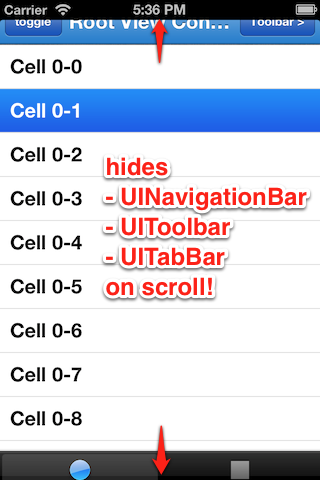

YIFullScreenScroll 1.4.0
========================

Pinterest-like scroll-to-fullscreen UI for iOS5+ (including iOS7).




Architecture
------------

- To achieve scroll-to-fullscreen behavior, `YIFullScreenScroll` uses [JRSwizzle](https://github.com/rentzsch/jrswizzle/) to extend `UIViewController`'s functionality, and KVO (Key-Value-Observing) instead of conforming to `UIScrollViewDelegate` for easiler implementation.

- `YIFullScreenScroll` enables/disables its functionality when `viewWillAppear` or `viewWillDisappear` is called. This means, fullscreen will not continue to the next pushed (2nd) viewController, and if you want to keep it, you also need to setup `self.fullScreenScroll` to the 2nd viewController's `viewDidLoad`.

- `YIFullScreenScroll` can only handle UINavigationController/UITabBarController's top & bottom UI-bars as default. To further adjust your custom UI-bar's layout, use `-fullScreenScrollDidLayoutUIBars:` delegate method (see [Issue #12](https://github.com/inamiy/YIFullScreenScroll/issues/12) for more detail).


Install via [CocoaPods](http://cocoapods.org/)
----------

```
pod 'YIFullScreenScroll'
```


How to use
----------

```
- (void)viewDidLoad
{
    [super viewDidLoad];

    self.fullScreenScroll = [[YIFullScreenScroll alloc] initWithViewController:self scrollView:self.tableView style:YIFullScreenScrollStyleFacebook];
    self.fullScreenScroll.delegate = self;
    self.fullScreenScroll.shouldShowUIBarsOnScrollUp = NO;

//    self.fullScreenScroll.shouldHideNavigationBarOnScroll = NO;
//    self.fullScreenScroll.shouldHideToolbarOnScroll = NO;
//    self.fullScreenScroll.shouldHideTabBarOnScroll = NO;
}

// implement below to further adjust your custom UI-bar's layout
- (void)fullScreenScrollDidLayoutUIBars:(YIFullScreenScroll*)fullScreenScroll 
{
    CGRect newFrame = self.customBar.frame;
    newFrame.origin.y += self.navigationController.navigationBar.frame.size.height;
    self.customBar.frame = newFrame;
}

```


Style
-----

```
typedef NS_ENUM(NSInteger, YIFullScreenScrollStyle) {
    YIFullScreenScrollStyleDefault,     // no statusBar-background when navBar is hidden
#if defined(__IPHONE_7_0) && __IPHONE_OS_VERSION_MAX_ALLOWED >= __IPHONE_7_0    
    YIFullScreenScrollStyleFacebook,    // like facebook ver 6.0, remaining navBar for statusBar-background in iOS7
#endif
};
```


UISearchDisplayController issue
-------------------------------

If you are using `UISearchDisplayController` in iOS7, there is a searchBar-bug that doesn't respond to touches when you slightly scrolled down (about searchBar height) and then activate searchDisplayController. To prevent it, call below method on `-searchBarShouldBeginEditing:`.

```
- (BOOL)searchBarShouldBeginEditing:(UISearchBar *)searchBar
{
    // NOTE: this code is needed for iOS7
    [self.fullScreenScroll adjustScrollPositionWhenSearchDisplayControllerBecomeActive];

    return YES;
}
```


Dependencies
------------
- [JRSwizzle 1.0](https://github.com/rentzsch/jrswizzle)
- [ViewUtils 1.1](https://github.com/nicklockwood/ViewUtils)


License
-------
`YIFullScreenScroll` is available under the [Beerware](http://en.wikipedia.org/wiki/Beerware) license.

If we meet some day, and you think this stuff is worth it, you can buy me a beer in return.
